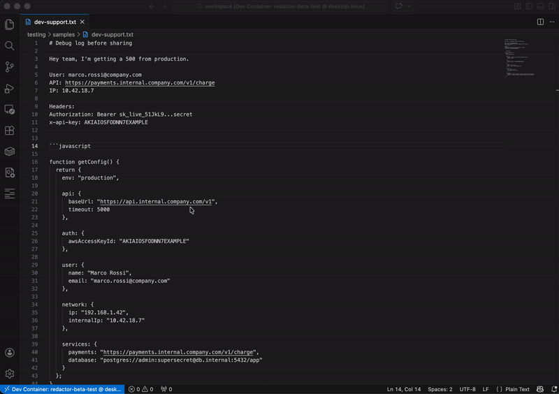

# RedActor — Anonymize Code in 1 Click




Anonymize sensitive data (emails, API keys, IPs, URLs) in code and logs instantly.

**Stop leaking secrets to AI, issues, and chats.**

RedActor anonymizes sensitive data directly in VS Code, locally.

## Why people install it

- Fast: run from context menu or command palette
- Safe: no cloud, no API calls, no data exfiltration
- Practical: preview diff before sharing

## What it anonymizes

- Emails → `user@email.com`
- URLs → `https://example.com`
- IPs → `0.0.0.0`
- Secrets/keys → `SECRET_1`, `SECRET_2`, ...
- Names → `PERSON_1`, `PERSON_2`, ...
- Your custom regex patterns

## Commands

- `Anonymize Code` (`redactor.anonymize`)
- `Anonymize Code (Preview Diff)` (`redactor.diff`)

## 1-second setup

1. Open your file
2. Right-click → **Anonymize Code**
3. Done — safe to share

## Custom rules (team-ready)

```json
"redactor.customPatterns": [
  {
    "name": "Internal Ticket",
    "regex": "/TICKET-[0-9]+/g",
    "replace": "TICKET-XXX"
  }
]
```

## Recommended settings

```json
"redactor.openInNewTab": true,
"redactor.highlight.enabled": true,
"redactor.highlight.color": "rgba(0, 255, 0, 0.15)"
```

## When to use

- Before pasting code into AI tools (ChatGPT, Copilot)
- Before posting logs on Slack or GitHub issues
- Before sharing snippets on Stack Overflow

**Copy less risk. Paste with confidence.**
